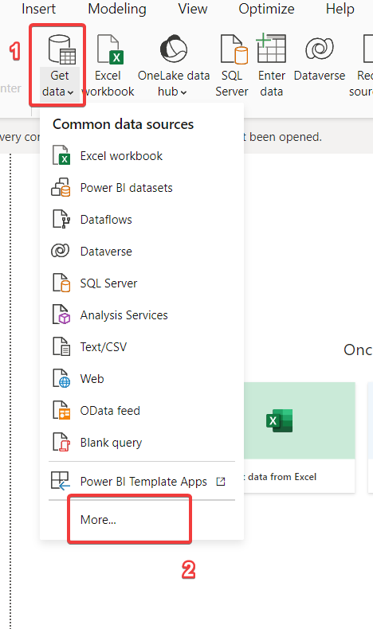
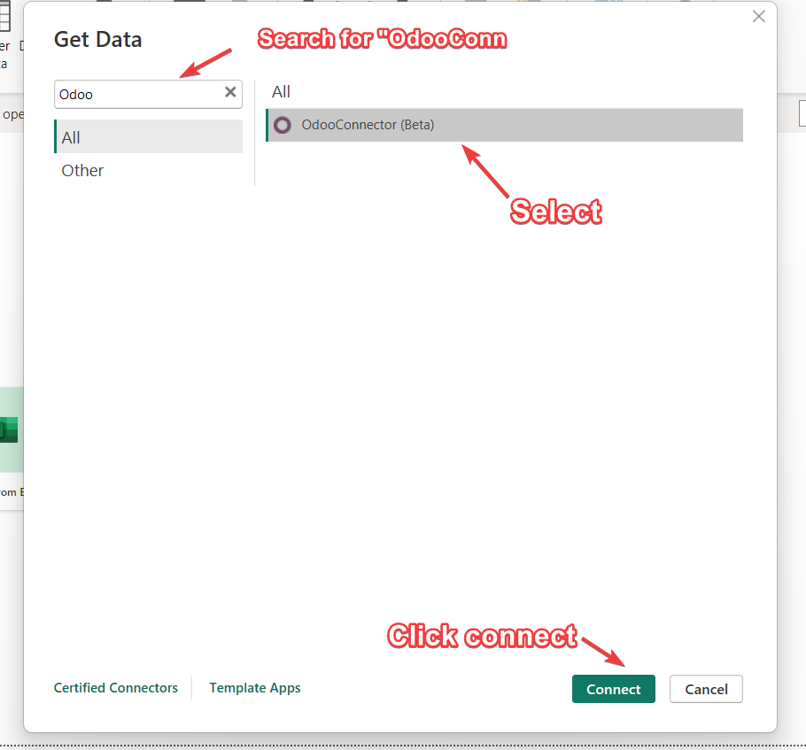
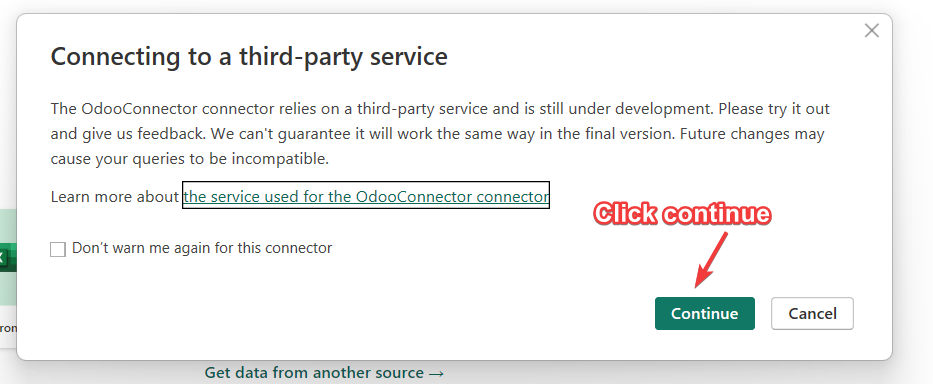
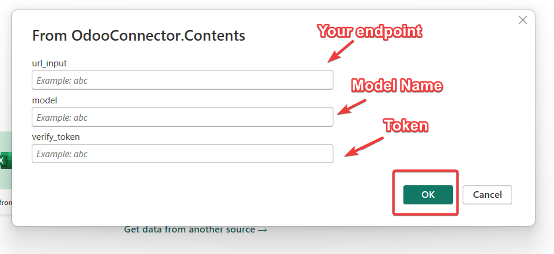
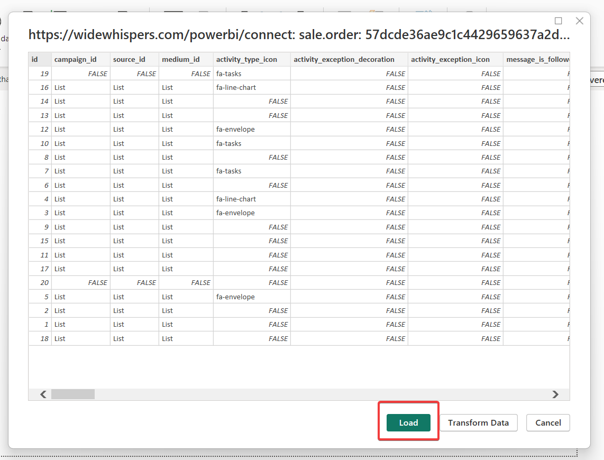

## Connect to Module
Here, you can connect to the connector in powerbi to enable load data from Odoo.

Firstly, you can get data (select connector OdooConnector) as in figure[4]

Figure [4] Connect to datasource.

Secondly, you can search for the connector named "OdooConnector" and click on "connect" as in figure[5]

Figure [5] Load to connector.

Then, you can verify the connector by clicking to "Continue" as in figure[6].

Figure [6] Connecting to service.

## Params

So, it's time to set the parameters that enable you to import data as:

URL: e.g. https://yourdomain.com/powerbi/connect.

Model Name: it's the name of the model, you need to collect data.

Token: it's the token in Odoo Settings. as in figure[7].

Figure [7] Connect to Model of Odoo.

## Loading Data
Finally, it's time to load data, as after setting the values of these parameters url, model_name, and token. The data is loaded as in figure [8].

Figure [8] Load Data.

After successfully loading data from Odoo into Power BI, you can unleash the power of data analysis. Start by designing compelling visualizations and reports to gain insights into your business operations. Utilize Power BI's intuitive tools to create interactive dashboards that provide a real-time view of your Odoo data. 
