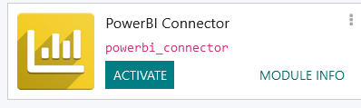
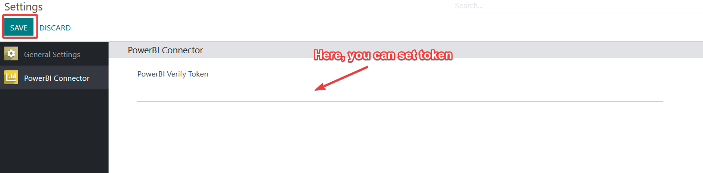
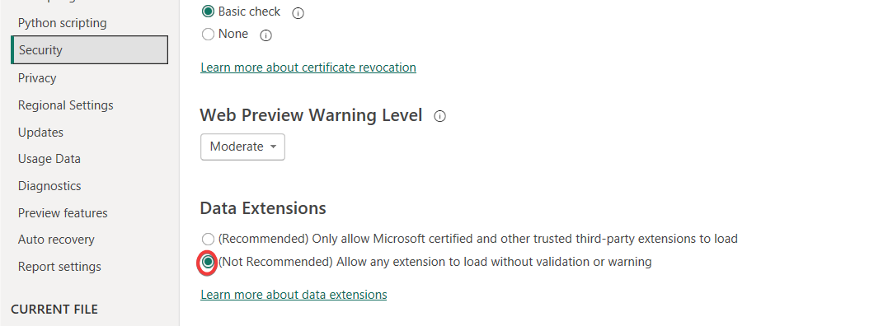

To begin using the PowerBI Connector module, you need a token that allows you to gather data from Odoo. With your token in hand, proceed to Power BI, where you can create a custom connector, inputting your Odoo API details. This connection empowers you to effortlessly visualize and analyze your Odoo data within Power BI.

Firstly, you can install PowerBI Connector from Apps as in figure[1]

Figure [1] Installation Module.

After you install the module, you can go to Settings you can find the module is activated. Then you can set token that allows you to collect data as in figure[2].

Figure [2] Activation Module.

Then, it's time to load custom connector in PowerBI Desktop. Firstly you must set .mez file to [Documents]/PowerBI Desktop/Custom Connectors.

Then open PowerBI Desktop, Go to File -> Options and settings -> Options -> In Security option, enable Allow any extension as in figure[3].

Figure [2] Connector Setting.

Congratulations! Now you can use the module. 